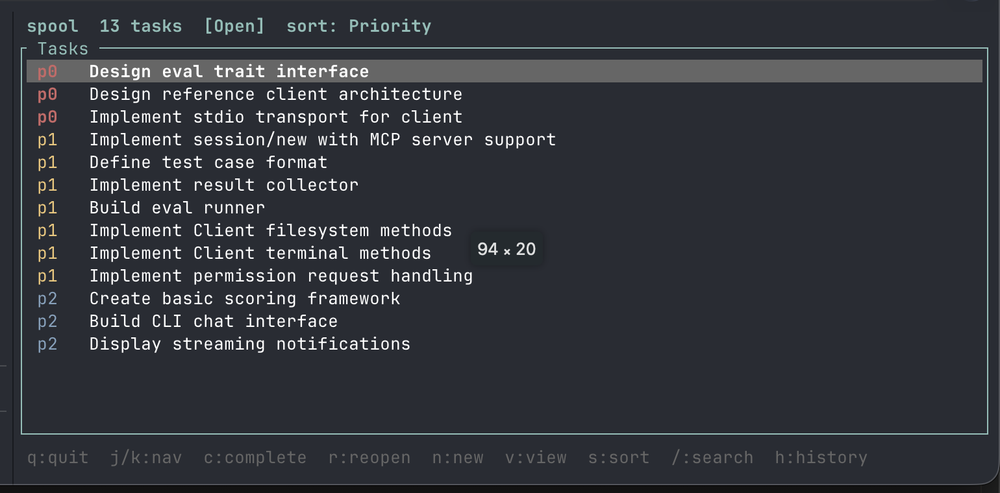
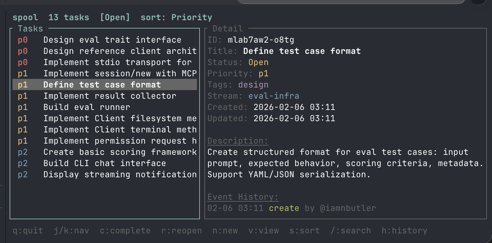
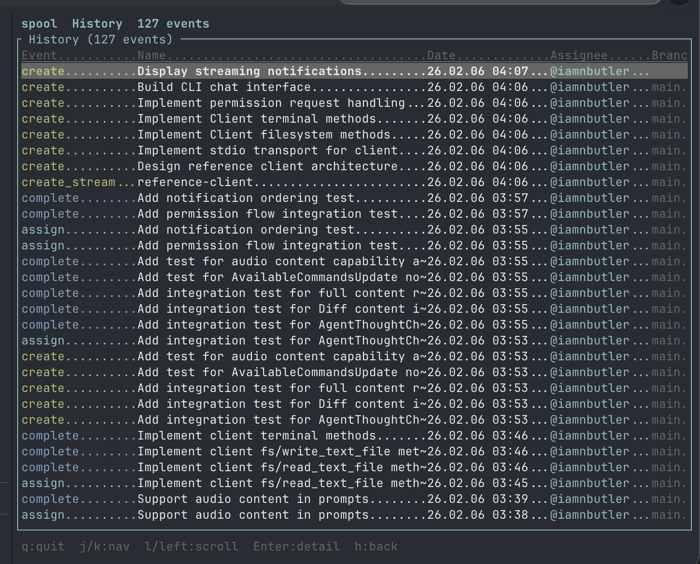

# Spool

[Spool](https://github.com/iamnbutler/spool) is a git-native, event-sourced task tracker. Tasks live in the repo as append-only event logs — no server, no SaaS, no separate system to keep in sync. It came out of exploring agentic orchestration workflows. Tools like [Beads](https://beads.dev) exist in this space, but the goal here was something more opinionated and personal — build the thing, use it daily, see what works.

```bash
cargo install spool-cli
spool init
spool add "Fix the thing" -p p0 -t bug
```

## Why files on disk

Your tasks should live where your code lives. When project tracking is a SaaS product, you're one acquisition or pricing change away from losing your history. Worse, the tracking is decoupled from the work — tasks exist in some web app while the actual context is in your repo, your branches, your commits.

Spool puts everything in `.spool/events/` as daily JSONL files. You commit them with your code. When you branch, your tasks branch. When you merge, your tasks merge. The tracking *is* the repo.

## Append-only JSONL

Every change — create, assign, complete, comment — is an immutable event appended to a log file:

```json
{"v":1,"op":"create","id":"k8b2x-a1c3","ts":"2026-01-13T12:00:00Z","by":"@alice","d":{"title":"Fix bug"}}
{"v":1,"op":"assign","id":"k8b2x-a1c3","ts":"2026-01-13T12:01:00Z","by":"@bob","d":{"to":"@bob"}}
{"v":1,"op":"complete","id":"k8b2x-a1c3","ts":"2026-01-13T14:00:00Z","by":"@bob","d":{"resolution":"done"}}
```

State gets materialized by replaying events. Caches are gitignored and rebuilt on demand with `spool rebuild`.

This matters most at scale. Imagine tens or hundreds of people working across branches. With mutable task files, every merge is a potential conflict. With append-only logs, conflicts are rare — two people appending events to the same daily log just means keeping both sets of lines. Even when conflicts do occur, resolution is trivial: keep everything, rebuild.

## The TUI

`spool-ui` gives you a terminal interface. Priority-sorted task list, detail pane with full event history, search, stream filtering.





The history view shows every event across the project — creates, completes, assigns, all with timestamps and branch info:



## Agents and open questions

Spool started as an experiment in agentic workflows, and so far it's working — agents can create tasks, update status, and track their own work through the CLI. But there are real challenges.

Getting agents to use it *consistently* is the main one. An agent will happily track tasks for a while, then forget to update status, or create duplicates, or ignore the existing backlog entirely. Discipline is hard enough for humans — turns out it's hard for agents too.

The team question is trickier. The obvious answer for keeping caches fresh is git hooks — post-merge, post-checkout, run `spool rebuild`. But git hooks are local, unenforced, and fragile. They don't travel with the repo in a way you can rely on. For a solo project or small team that's fine. For a real team, there needs to be something better. Still figuring that part out.

This site uses spool for its own task tracking — the `.spool/` directory in the repo is the real thing, not a demo.
