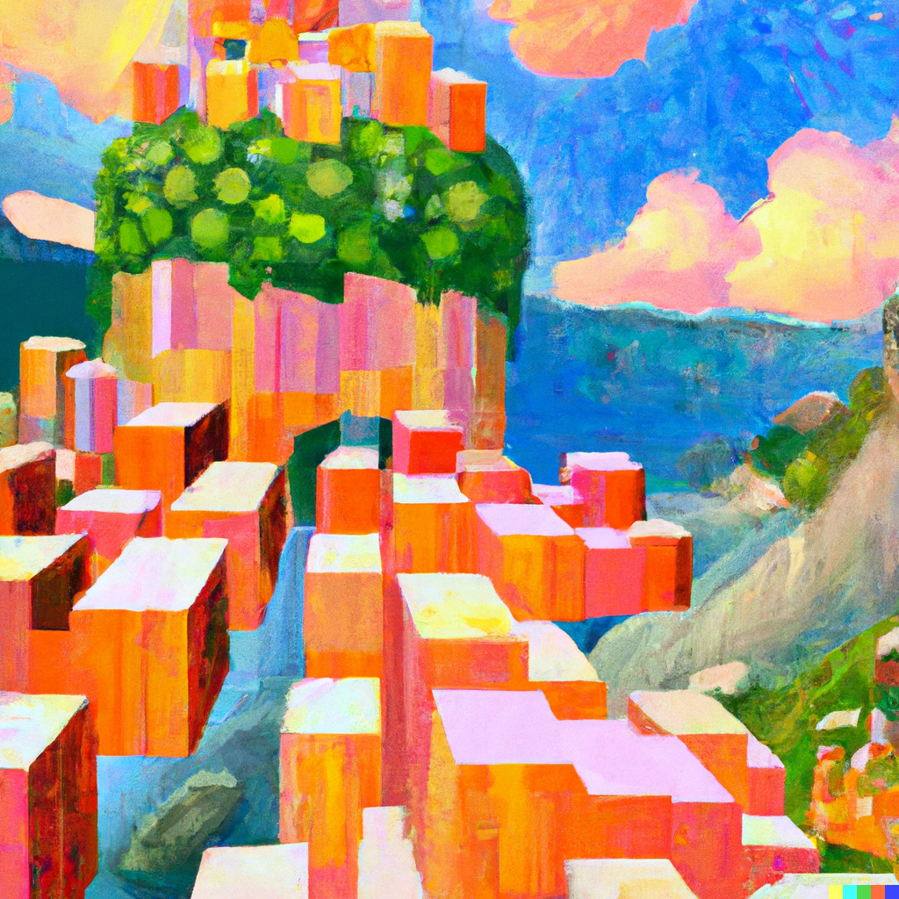
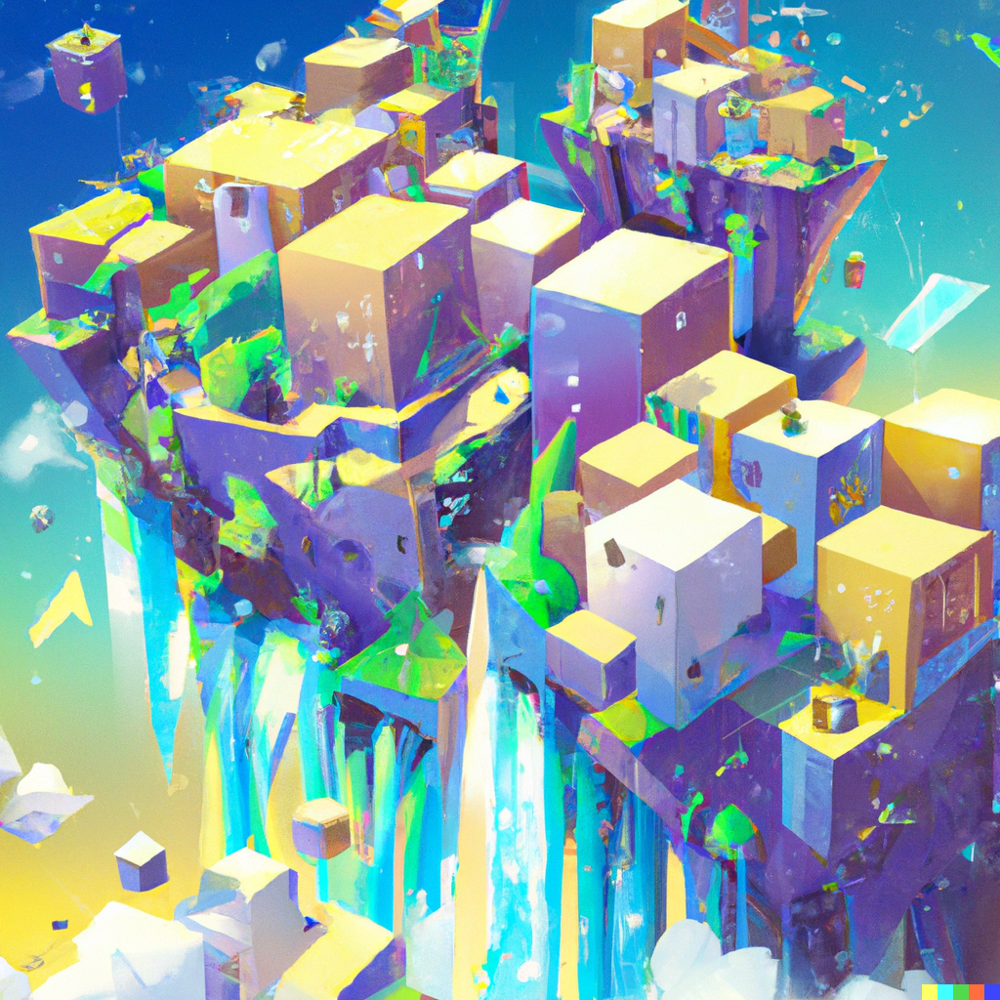
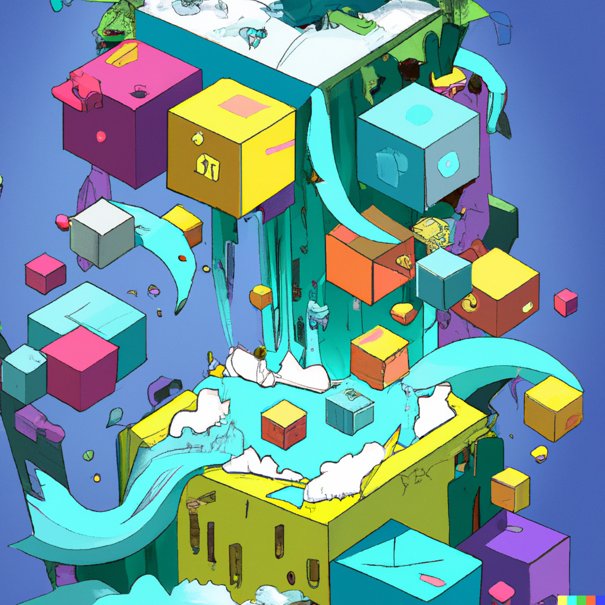
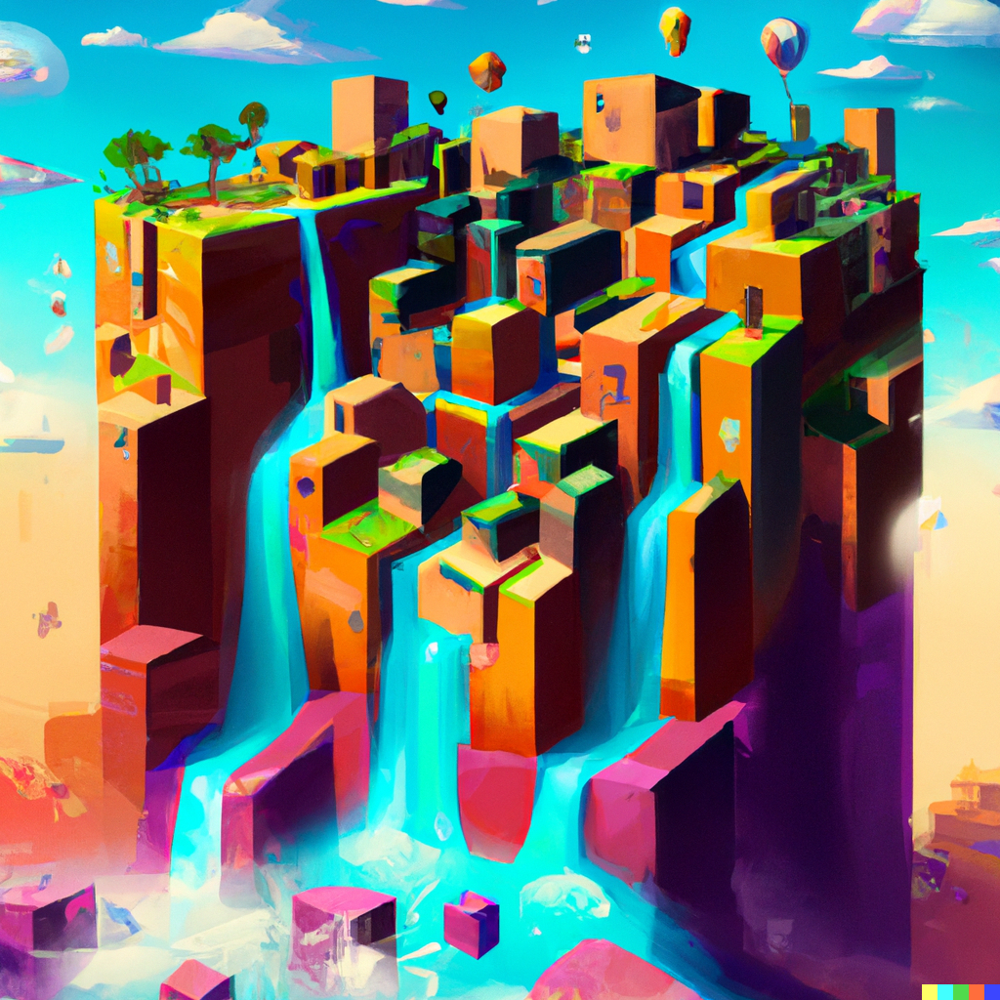
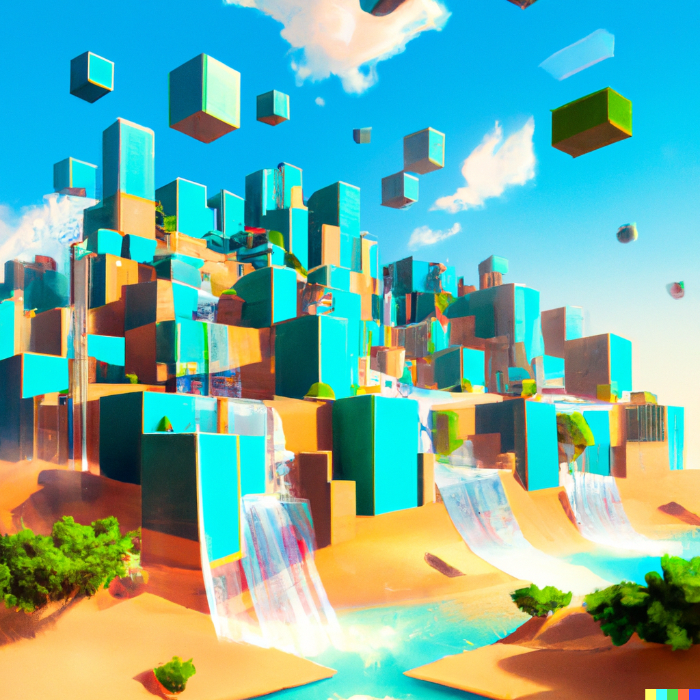
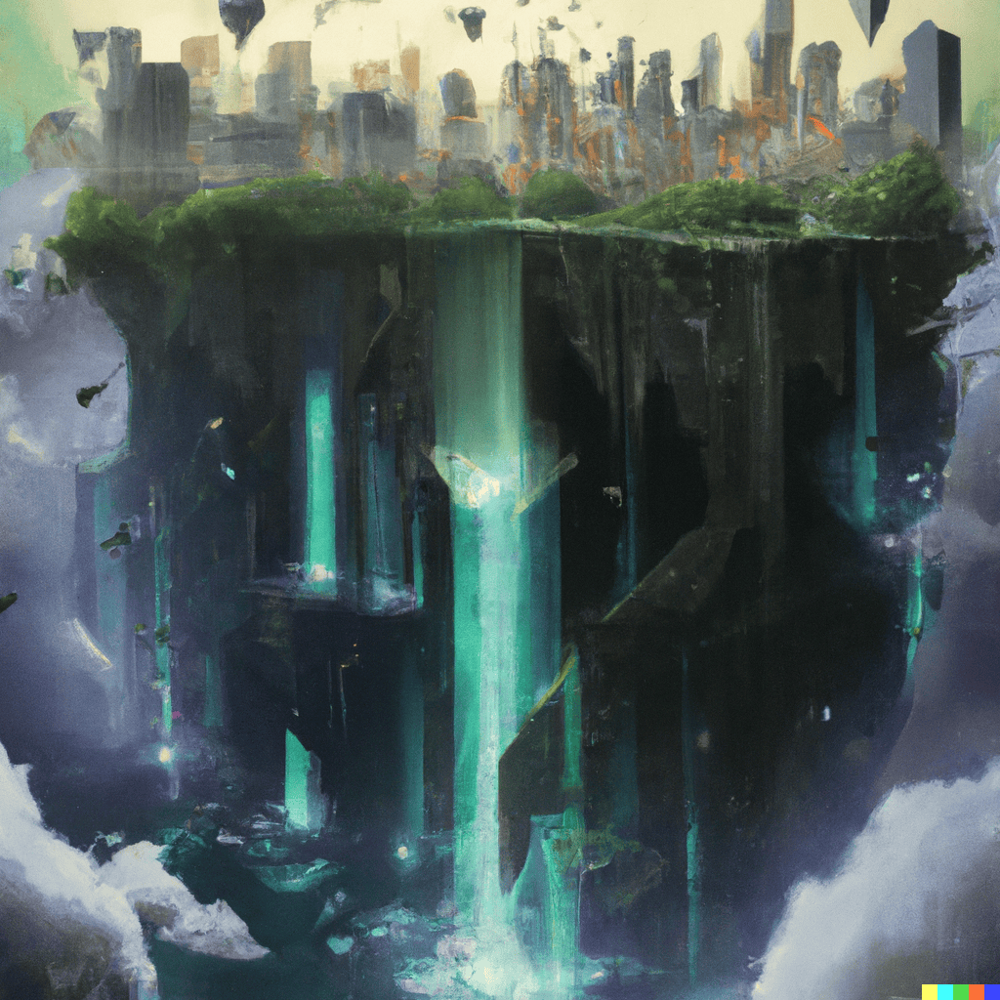
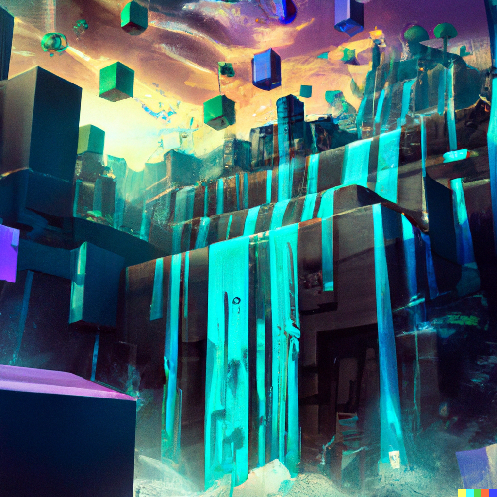

I've always been particularily attracted to concept art – Looking at worlds like that of Guild Wars 2, Bloodborne, or the worlds of Ghibli so much can be felt and understood from a single image. You don't have to play a game or watch a movie to get a feel for the world that exists inside these images.

When I saw people using DALL·E for the first time, I immediately thought "I wonder what type of worlds DALL·E would imagine?" There is a certian sense of serendipity and wonder to typing some words and getting back a world that feels full of secrets and potential adventures. I can only imagine the fun I would have had playing with a tool like DALL·E as a child.
