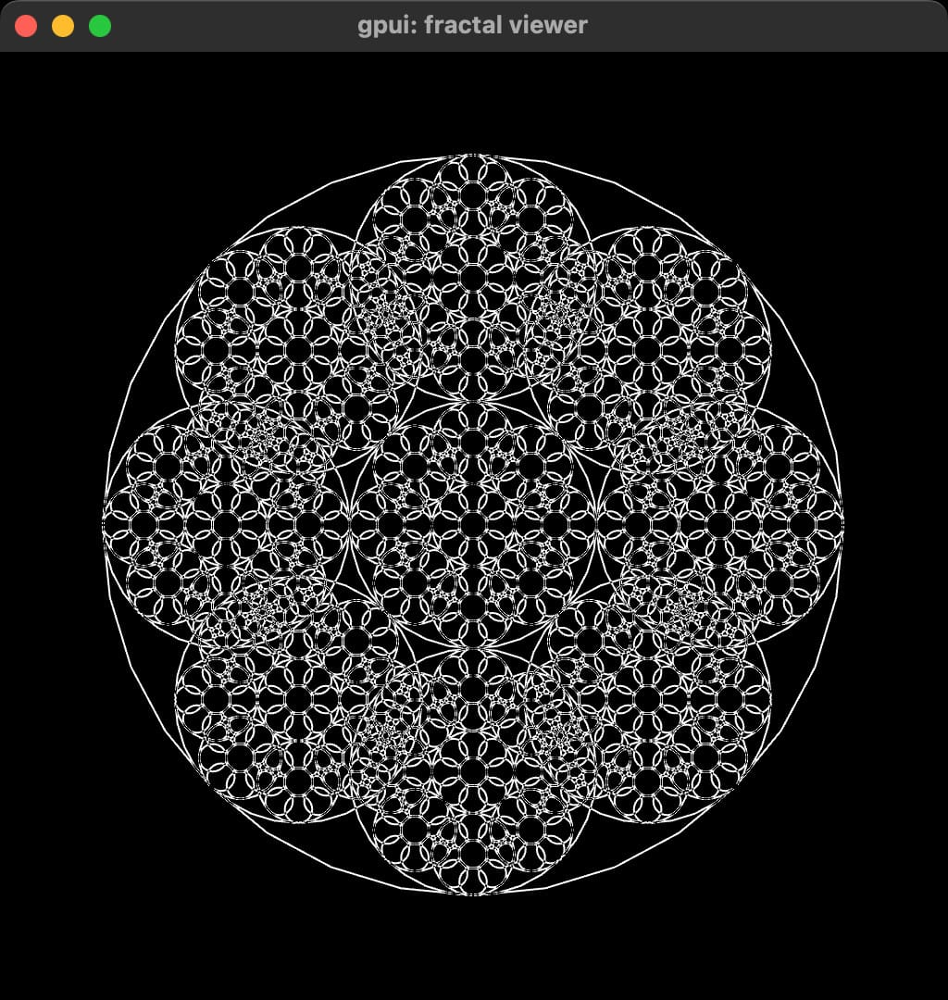
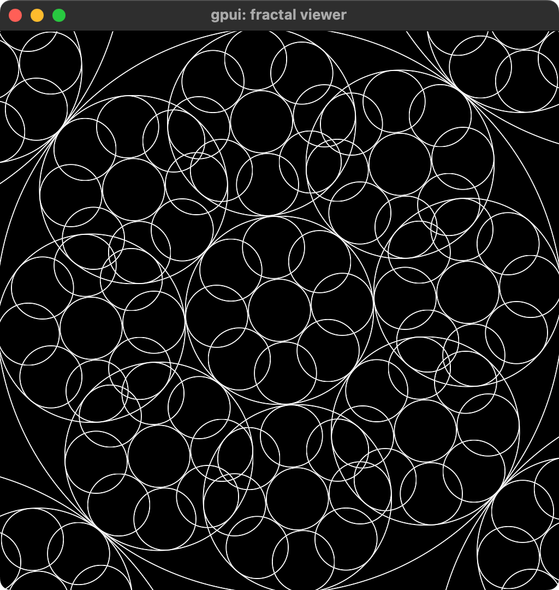
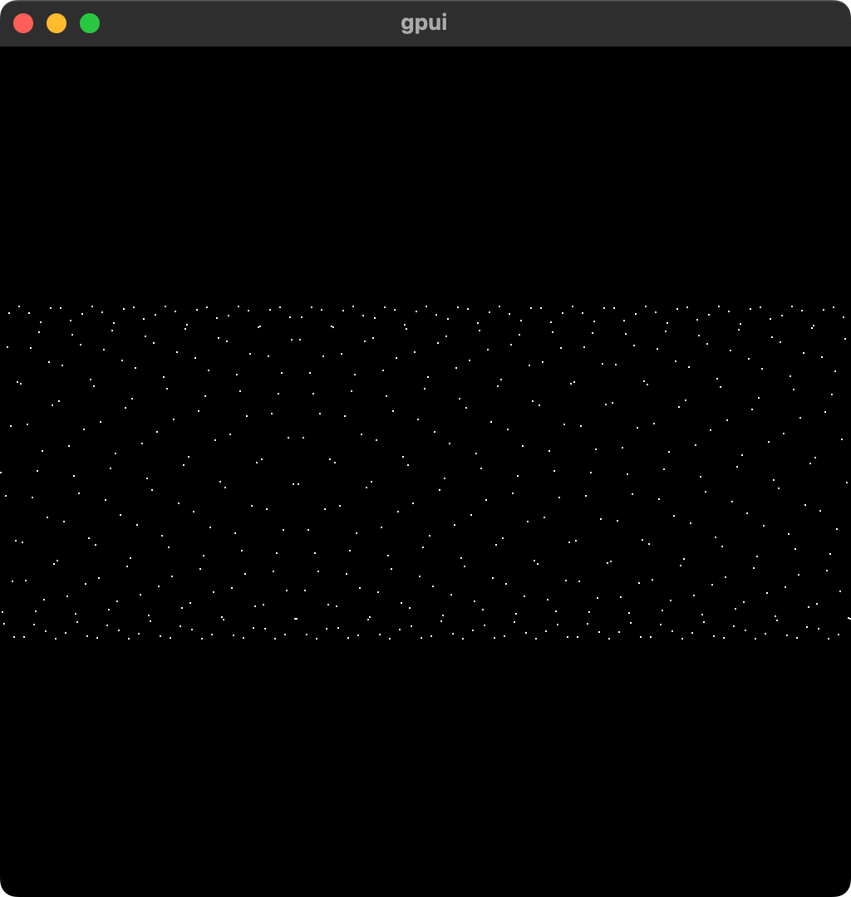
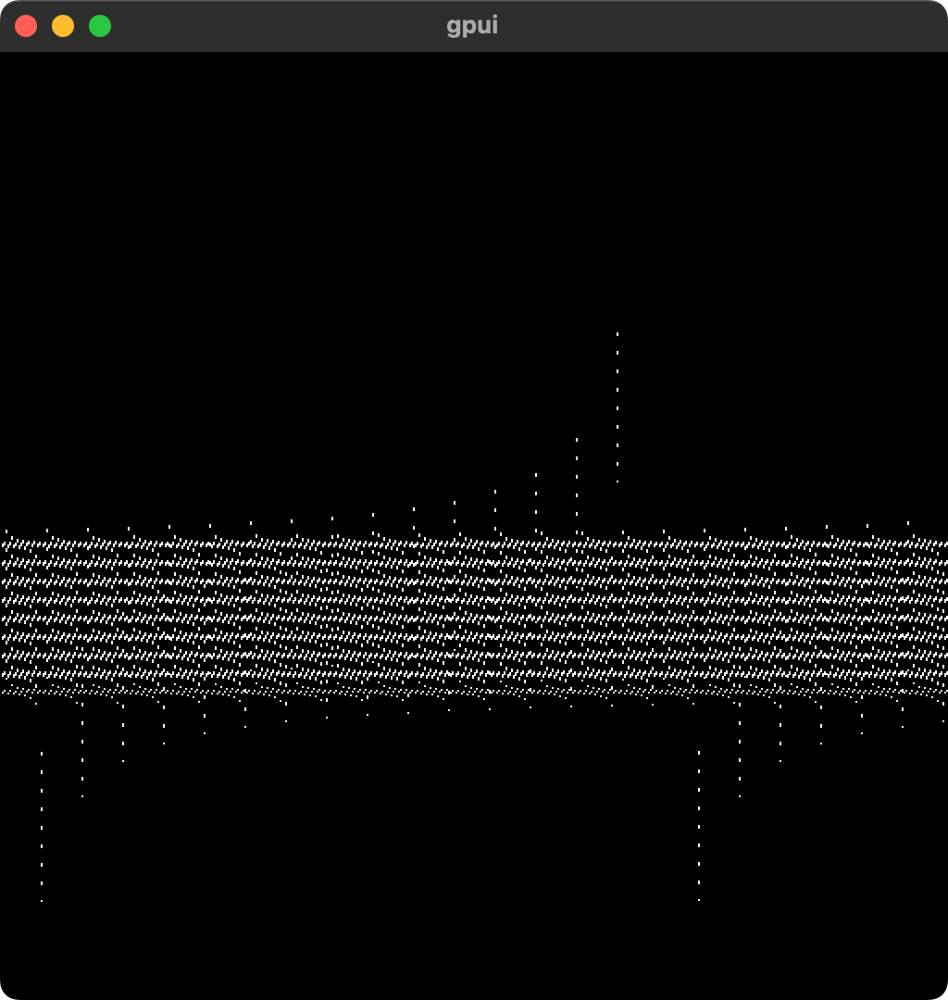
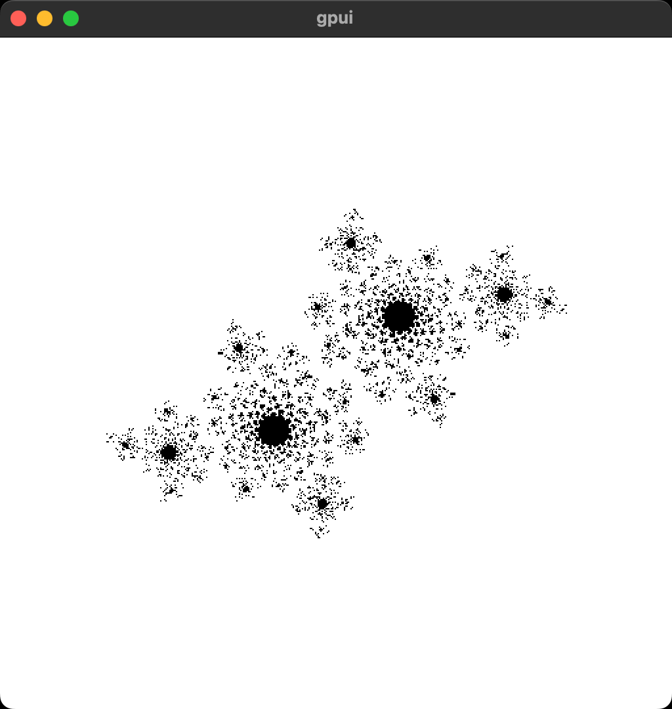
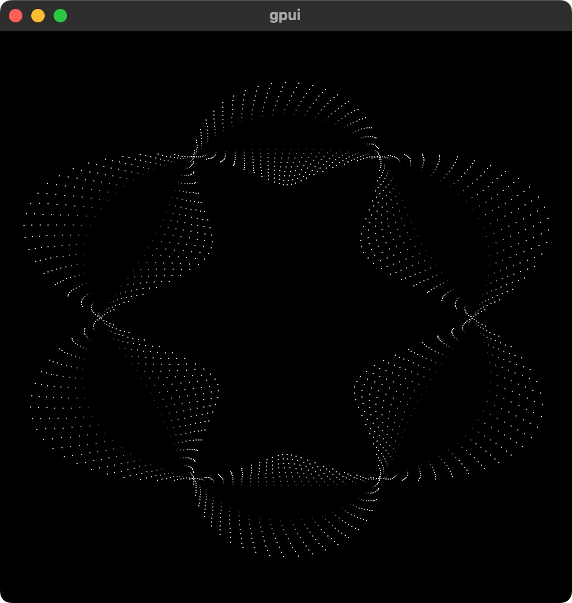
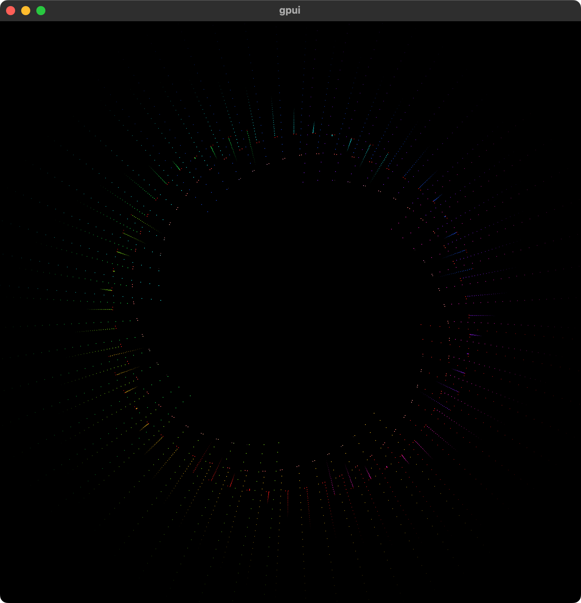
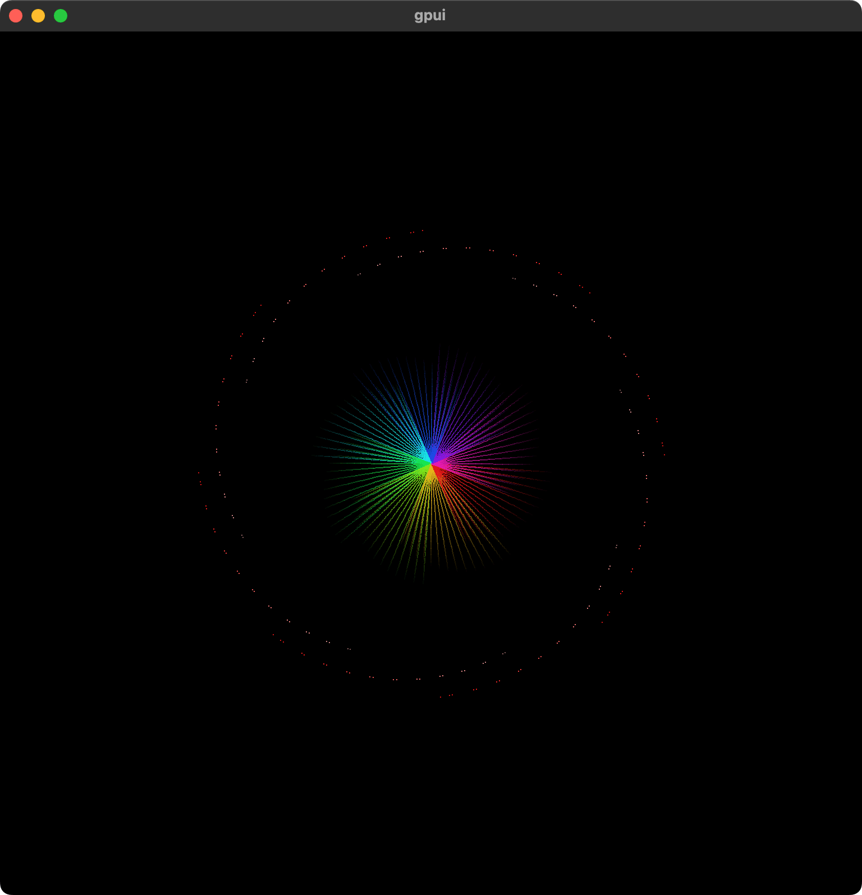
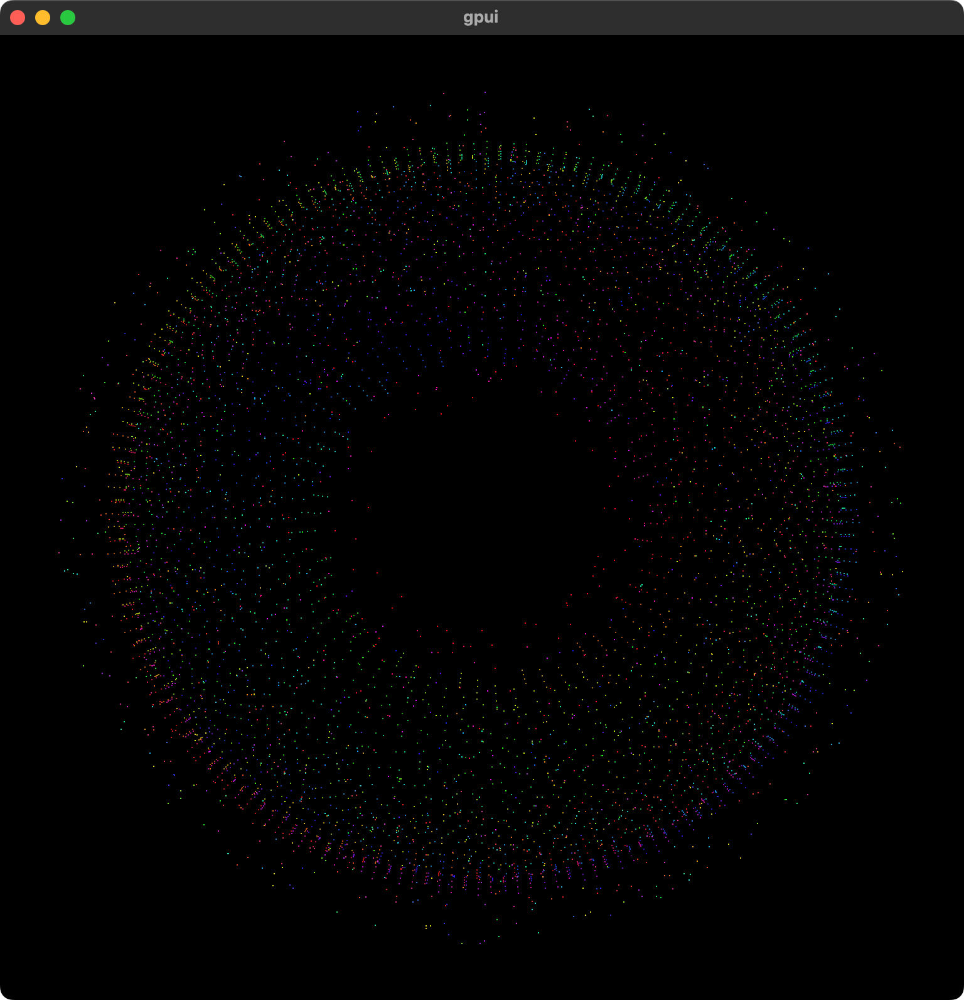
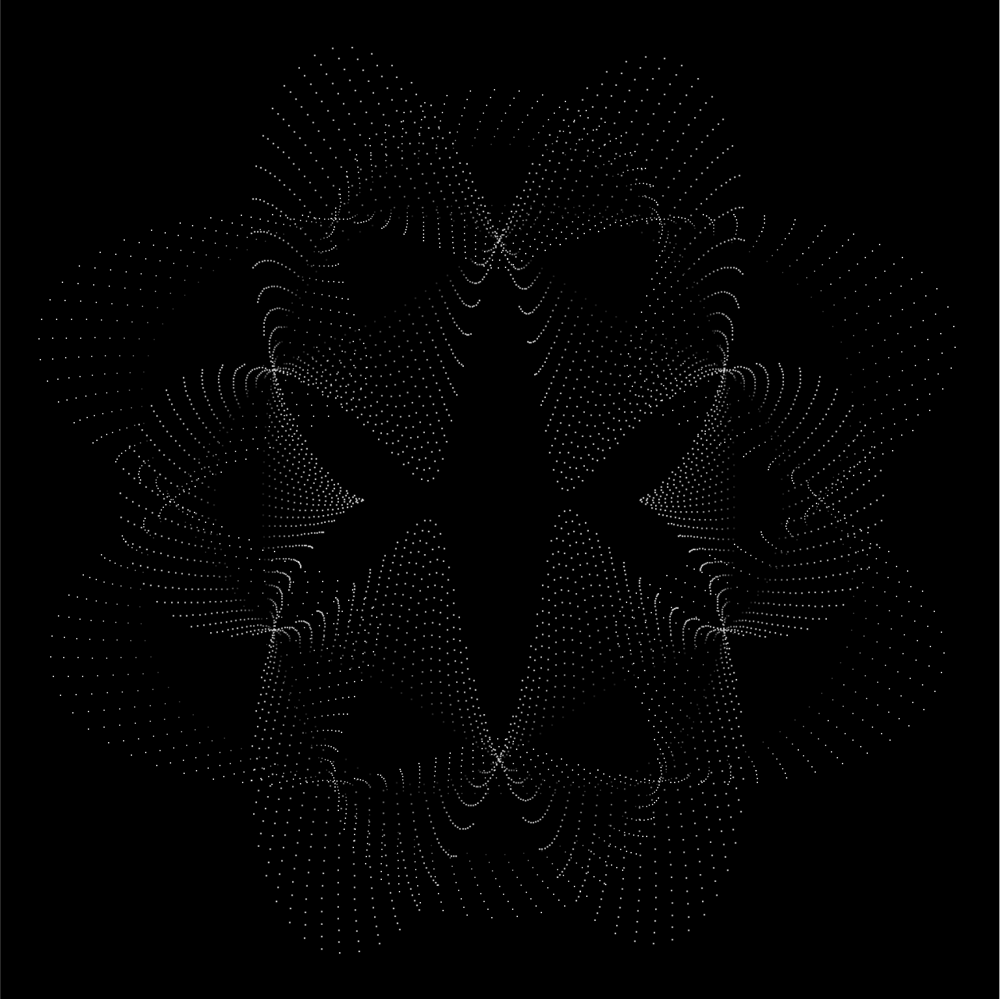

A little collection of fractal and other geometric drawing explorations using [gpui](https://gpui.rs). The thumbnail is a composite of two images.

Some unorganized source code here: [iamnbutler/gpui-fractals](https://github.com/iamnbutler/gpui-fractals)

This one exposed some issues with the gpui path renderer. We've been exploring some fixes!

