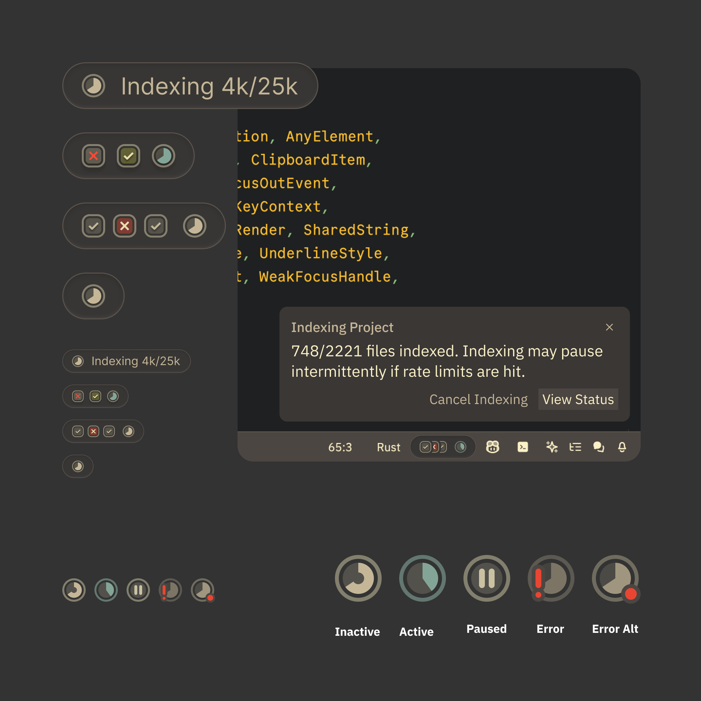

A fun little status bar widget system I explored while we were working on building semantic indexing for Zed.

These would give context on running tasks, successes, and failures, and provide an anchor point for notifications of things you might need to take action on.

